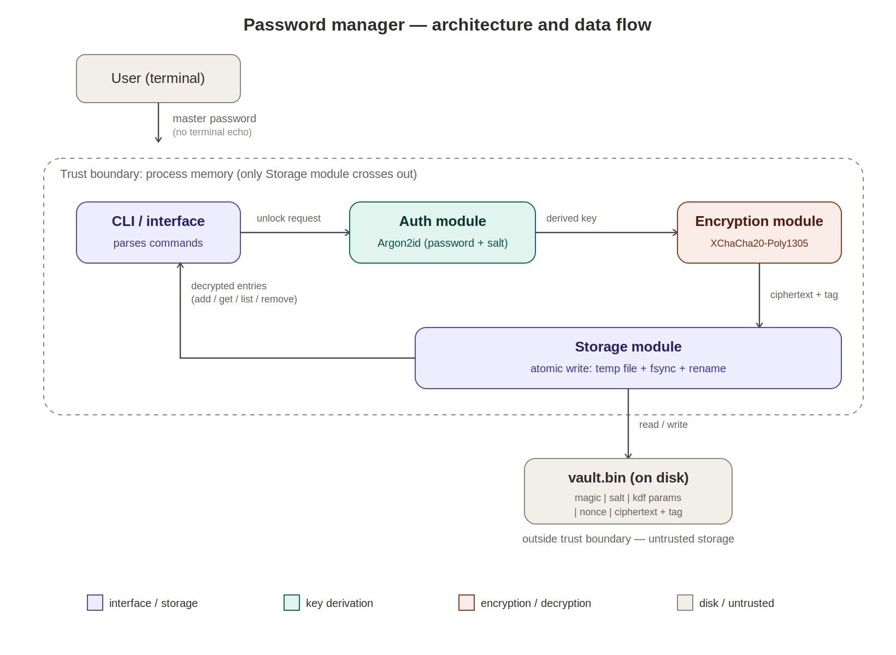

# Secure Password Manager — Checkpoint 1: Threat Model and Architecture

## 1. Scope

A command-line password manager that stores entries (name, username, password,
notes) encrypted in a single vault file, unlocked by one master password.

Planned commands:
- `pwman init` — create a new vault, set the master password
- `pwman add <name>` — add an entry
- `pwman get <name>` — decrypt vault, print one entry
- `pwman list` — print entry names only (vault must still be unlocked)
- `pwman remove <name>` — delete an entry
- `pwman passwd` — change the master password (re-encrypts the vault)

## 2. Language and libraries

**Language:** C

**Library:** [libsodium](https://libsodium.org) rather than raw OpenSSL.
Justification: libsodium exposes high-level, misuse-resistant primitives
(`crypto_pwhash`, `crypto_aead_xchacha20poly1305_ietf_*`, `sodium_memzero`,
`sodium_mlock`) with sane defaults, so there are far fewer footguns than
building the same thing from OpenSSL's low-level EVP API. For a course about
*secure* programming, minimizing places where the programmer can misuse the
crypto API is itself a security design decision.

## 3. Cryptographic scheme and vault format

- **Key derivation:** Argon2id (`crypto_pwhash`) turns the master password +
  a random 16-byte salt into a 256-bit key. Argon2id is deliberately slow and
  memory-hard, so brute-forcing a stolen vault offline is expensive.
- **Encryption:** XChaCha20-Poly1305 (`crypto_aead_xchacha20poly1305_ietf`),
  an authenticated encryption scheme — it detects tampering, not just hides
  content.
- **Vault file layout** (`vault.bin`):

  ```
  [ magic "PWV1" (4B) ]
  [ kdf salt (16B) ]
  [ kdf opslimit, memlimit (8B) ]
  [ nonce (24B) ]
  [ ciphertext + Poly1305 tag (variable) ]
  ```

  The header (magic/salt/kdf params/nonce) is plaintext by necessity — you
  need it before you can even attempt decryption. Everything after it is
  ciphertext; entries are never written to disk unencrypted.
- **Save flow:** entries are serialized to JSON in memory → a fresh random
  nonce is generated → encrypted → written to a temp file → `fsync` →
  atomic rename over `vault.bin`, so a crash mid-write can't leave a
  half-written vault.

## 4. Architecture



Four components, in increasing trust order from the user down to disk:

| Component | Responsibility |
|---|---|
| CLI / interface | Parses commands, prompts for the master password (never accepted as a CLI argument), calls the other modules |
| Auth module | Derives the encryption key from the master password + salt via Argon2id |
| Encryption module | Encrypts/decrypts the vault blob with XChaCha20-Poly1305; wipes keys and plaintext from memory after use |
| Storage module | Reads/writes `vault.bin`, sets file permissions, performs atomic writes |

**Trust boundaries:**
1. User input → CLI (untrusted until validated)
2. Process memory ↔ disk, at the Storage module (the vault file is the only
   thing that leaves the process, and only as ciphertext)
3. Process memory itself is only semi-trusted: other processes, swap, or
   core dumps could expose it, which is why key material is scrubbed and
   swap-locked

## 5. Threat model

| Area | Threat | Mitigation |
|---|---|---|
| **Master password** | Weak/guessable password → brute force | Argon2id with high time/memory cost slows offline guessing; encourage passphrases in the CLI prompt |
| | Password captured by keylogger / shoulder-surfing while typed | Disable terminal echo when prompting (no password ever shown or accepted as a CLI arg); documented as residual risk we cannot fully mitigate |
| | Offline brute force against a stolen vault file | Argon2id KDF, unique random salt per vault |
| **Vault at rest** | Vault file stolen from disk (theft, backup leak, other local user) | AEAD encryption — ciphertext is unreadable without the derived key |
| | Vault file tampered with (bit-flip / truncation attack) | Poly1305 authentication tag; decryption fails closed on any modification |
| | Vault file left world-readable | Set file permissions to `0600` on creation; warn on startup if permissions are wrong |
| | Partial/plaintext vault written on crash | Atomic write: write to temp file, `fsync`, rename over the original |
| **Vault in memory** | Master key or decrypted entries swapped to disk | `sodium_mlock` on key/plaintext buffers to prevent swapping |
| | Key/plaintext left in memory after use, recoverable via core dump or another process | `sodium_memzero` to wipe buffers after use; disable core dumps (`setrlimit(RLIMIT_CORE, 0)`) |
| | Buffer overflow elsewhere in the process leaks memory containing the key | Bounds-checked string handling, `-fstack-protector-strong`, `_FORTIFY_SOURCE=2`, ASLR enabled at build/link time |
| **Interface (CLI)** | Command injection / unsafe argument parsing | No `system()`/`popen()` with unsanitized input; fixed argument parsing only |
| | Password leaked via shell history or `ps` if passed as a CLI argument | Master password and entry passwords are only ever entered interactively, never as arguments |
| | Timing attack on any manual comparison (e.g. confirm-password check) | Constant-time comparison (`sodium_memcmp`) for anything not already handled by the AEAD tag check |

## 6. Notes / open questions for next checkpoint

- Whether to support multiple vaults per user or a single fixed path (`~/.pwman/vault.bin`)
- Whether `passwd` re-encrypts in place or writes a new vault and swaps
